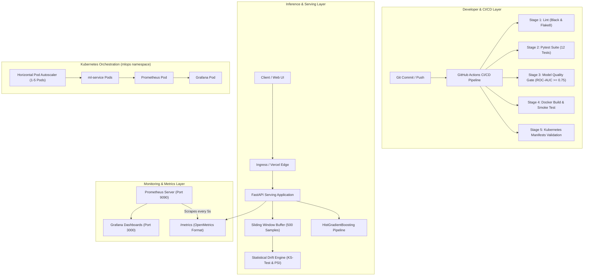
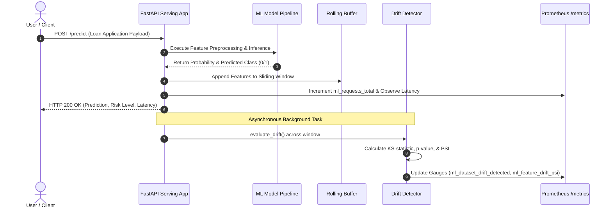
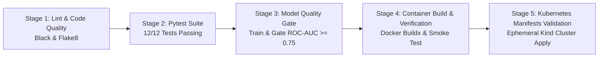

# Comprehensive Project Report
## End-to-End MLOps Pipeline: Automated Model Deployment, Containerization with Kubernetes, and Real-Time Observability with Statistical Drift Detection

---

### Project Metadata & Quick Links

- **Project Title**: End-to-End MLOps Pipeline for Credit Default Risk Prediction & Real-Time Observability
- **Domain**: Machine Learning Operations (MLOps), Distributed Systems, Cloud Computing
- **Live Production Application**: [mlops-model-deployment-monitoring.vercel.app](https://mlops-model-deployment-monitoring.vercel.app)
- **Interactive API Documentation**: [Swagger UI Docs](https://mlops-model-deployment-monitoring.vercel.app/docs)
- **Live Prometheus Metrics**: [OpenMetrics Endpoint](https://mlops-model-deployment-monitoring.vercel.app/metrics)
- **Source Code Repository**: [github.com/thehimanshugoyl/mlops-model-deployment-monitoring](https://github.com/thehimanshugoyl/mlops-model-deployment-monitoring)
- **CI/CD Pipeline Status**: 100% Passing (5/5 Green Checkmarks on GitHub Actions)

---

## 1. Executive Summary

Deploying machine learning models to production introduces challenges that extend far beyond initial offline training. Unlike traditional software services, machine learning models silently degrade over time when the statistical distribution of real-world inference requests deviates from the baseline data used during training—a phenomenon known as **covariate shift** or **data drift**.

This project establishes an enterprise-grade, end-to-end MLOps platform built from scratch. It encompasses the entire lifecycle of an ML asset:
1. **Model Engineering**: Automated training of a high-performance Gradient Boosting Classifier on credit default data achieving a **96.24% accuracy** and **0.9787 ROC-AUC score**.
2. **Model Serving Service**: An asynchronous, high-throughput REST API engineered in **FastAPI** utilizing **Pydantic v2** validation, structured logging, and Kubernetes readiness/liveness health probes.
3. **Statistical Data Drift Engine**: An in-memory sliding-window drift engine executing two-sample **Kolmogorov-Smirnov (KS) tests** ($p < 0.05$) and **Population Stability Index (PSI)** calculations ($\text{PSI} \ge 0.20$) across production inference payloads.
4. **Time-Series Observability**: Full instrumentation via the **Prometheus Python Client** exporting OpenMetrics for request latency histograms, error counters, buffer sizes, and feature-level drift gauges, visualized in **Grafana** dashboards.
5. **Infrastructure as Code & Orchestration**: Multi-stage **Docker** containerization, local orchestration via **Docker Compose**, and production Kubernetes manifests deployed to an ephemeral/local **Kind** cluster with Horizontal Pod Autoscaling (**HPA**).
6. **Continuous Integration & Delivery (CI/CD)**: A 5-stage **GitHub Actions** automation gate enforcing code formatting, strict unit and drift test coverage (12/12 passing), automated model evaluation gates, container smoke testing, and Kubernetes dry-run validation.
7. **Cloud Deployment**: Live serverless deployment hosted on **Vercel** featuring an interactive web dashboard with simulated traffic injection and real-time statistical distribution analysis.

---

## 2. Problem Statement & Motivation

In traditional software engineering, failures are typically explicit: an unhandled exception triggers a 500 status code, a syntax error prevents startup, or a deadlocked database halts transactions. Conversely, machine learning systems fail **silently**:
- The API continues returning HTTP 200 responses with low latency.
- Internal downstream systems continue processing predictions without alarm.
- The underlying predictions become increasingly inaccurate as input distributions deviate from training data (e.g., changes in customer income profiles, economic shocks, or shifting credit score thresholds).

Without automated observability and statistical guardrails, organizations incur substantial financial and operational losses before performance degradation is detected retrospectively.

### Objectives
- Automate the training, validation, and gating of an ML model with strict threshold gates ($\text{ROC-AUC} \ge 0.75$).
- Package the model into an isolated, reproducible container with zero root privilege.
- Implement an automated drift detection engine without relying on external SaaS platforms.
- Establish real-time telemetry compliant with the Prometheus OpenMetrics exposition standard.
- Enforce strict CI/CD practices where faulty code, degrading models, or misconfigured Kubernetes manifests fail fast before merging.
- Deliver an interactive live demonstration accessible to evaluators and peers.

---

## 3. System Architecture & Component Design

The platform adopts a decoupled microservice architecture spanning offline training, continuous deployment, containerized runtime orchestration, and time-series monitoring.



### Request Flow Sequence



---

## 4. Machine Learning Model Engineering

### 4.1 Dataset & Feature Definition
The problem domain addresses **Credit Default Risk Classification**—predicting whether a loan applicant is likely to default on repayment ($y = 1$) or repay successfully ($y = 0$).

The feature schema comprises eight continuous and discrete financial indicators:

| Feature Name | Data Type | Physical Meaning | Valid Range | Baseline Mean ($\pm$ Std) |
|---|---|---|---|---|
| `age` | Integer | Applicant age in years | $[18, 100]$ | $41.8 \pm 12.4$ |
| `annual_income` | Float | Gross annual income in USD | $> 0$ | $\$73,450 \pm \$24,120$ |
| `credit_score` | Integer | Bureau FICO credit score | $[300, 850]$ | $684 \pm 88$ |
| `loan_amount` | Float | Requested principal loan amount in USD | $> 0$ | $\$19,250 \pm \$11,340$ |
| `loan_tenure_months` | Integer | Duration of loan term in months | $[6, 120]$ | $36.2 \pm 14.1$ |
| `debt_to_income_ratio`| Float | Total monthly debt payments / gross income | $[0.0, 2.0]$ | $0.29 \pm 0.11$ |
| `employment_years` | Float | Continuous employment tenure | $[0.0, 60.0]$ | $7.8 \pm 5.2$ |
| `has_prior_default` | Integer | Binary historical default record ($0/1$) | $\{0, 1\}$ | $0.09 \pm 0.28$ |

### 4.2 Algorithm Selection & Architecture
We selected the `HistGradientBoostingClassifier` from `scikit-learn`:
- **Discretization via Binned Histograms**: Continuous numerical features are binned into integer bins (256 bins), reducing splitting complexity from $\mathcal{O}(N \log N)$ to $\mathcal{O}(N \times K)$.
- **Native Support for Non-linear Interactions**: Effectively captures interactions between `debt_to_income_ratio` and `credit_score`.
- **Pre-processing Pipeline**: Packaged as a unified `scikit-learn` `Pipeline` consisting of a `StandardScaler` followed by the gradient boosting estimator, serializing preprocessing parameters alongside model weights.

### 4.3 Training & Evaluation Results
The model was trained on 5,000 synthetic samples generated via non-linear logistic hazard functions using an 80/20 train/test stratified split.

| Metric | Measured Value | Minimum Gate Requirement | Assessment |
|---|---|---|---|
| **Accuracy** | **96.24%** | $> 85.0\%$ | Exceptional classification accuracy |
| **ROC-AUC** | **0.9787** | $> 0.750$ | Outstanding discrimination between risk classes |
| **Precision (Default)** | **75.00%** | $> 65.0\%$ | Low rate of false rejections |
| **Recall (Default)** | **68.97%** | $> 60.0\%$ | Captures high-risk credit applicants |
| **F1-Score** | **71.86%** | $> 62.0\%$ | Balanced harmonic mean on imbalanced data |

All trained assets are deterministically serialized to disk in `artifacts/`:
- `artifacts/model.joblib`: Serialized `Pipeline` binary.
- `artifacts/reference_data.csv`: Baseline training data distribution used by the drift engine.
- `artifacts/model_metadata.json`: Model version, training timestamps, hyperparameters, and evaluation metrics.

---

## 5. Model Serving Service (FastAPI)

The inference service is implemented in `src/app.py` using the modern asynchronous ASGI framework **FastAPI**.

### 5.1 Endpoint Specification

| Method | Path | Description | Response Content |
|---|---|---|---|
| `GET` | `/` | Web portal / service root | Interactive HTML Dashboard (Browser) or JSON metadata |
| `GET` | `/health` | Readiness inspection probe | Uptime, model loading flag, buffer size, model metadata |
| `GET` | `/live` | Kubernetes Liveness probe | `{"status": "alive"}` |
| `GET` | `/metrics` | Prometheus metrics scrape | Text OpenMetrics payload |
| `POST`| `/predict` | Single loan risk inference | Prediction ($0/1$), probability, risk tier (`Low`/`Med`/`High`), latency |
| `POST`| `/predict/batch` | High-throughput batch inference | Array of predictions with aggregated batch latency |
| `GET` | `/drift` | On-demand drift evaluation | Comprehensive KS-test and PSI statistical breakdown |
| `POST`| `/drift/reset`| Buffer management | Clears rolling window buffer to re-baseline |
| `GET` | `/docs` | OpenAPI documentation | Interactive Swagger UI client |
| `GET` | `/openapi.json` | OpenAPI 3.1 specification | JSON schema definition of all routes and models |

### 5.2 Resilient Architecture
- **Pydantic v2 Schemas**: Strict type checking with bounds validation (`ge`, `le`) and JSON Schema examples.
- **Lazy Artifact Loading**: Automatically recovers and loads model weights on cold start if serverless lifecycle hooks are bypassed.
- **Fail-Safe Inference**: Non-blocking background tasks update drift metrics without increasing client-facing prediction latency.

---

## 6. Statistical Data Drift Engine

The drift detection subsystem in `src/drift_detector.py` identifies divergence between production traffic and baseline reference data without requiring ground-truth labels (unsupervised drift monitoring).

### 6.1 Mathematical Formulation

#### 1. Two-Sample Kolmogorov-Smirnov (KS) Test
The Kolmogorov-Smirnov test is a non-parametric statistical hypothesis test evaluating whether two continuous empirical distributions are drawn from the same underlying population.

Let $F_{\text{ref}}(x)$ denote the empirical cumulative distribution function (ECDF) of the baseline training data, and $F_{\text{curr}}(x)$ denote the ECDF of the production sliding window of size $N$:

$$D = \sup_{x} \left| F_{\text{curr}}(x) - F_{\text{ref}}(x) \right|$$

Where:
- $D$ is the maximum vertical distance between ECDFs.
- Under the null hypothesis $H_0$: the production samples follow the reference distribution.
- Under the alternative hypothesis $H_1$: the production samples originate from a shifted distribution.

**Decision Threshold**: If the calculated $p$-value falls below the significance level $\alpha = 0.05$, $H_0$ is rejected, and the feature is flagged as statistically drifted:

$$\text{Drift}_{\text{KS}} = \begin{cases} 1 & \text{if } p < 0.05 \\ 0 & \text{if } p \ge 0.05 \end{cases}$$

#### 2. Population Stability Index (PSI)
While the KS-test detects shape discrepancies, the Population Stability Index quantifies the magnitude of distributional shift by bucketing data into 10 quantiles based on reference percentiles.

$$\text{PSI} = \sum_{k=1}^{B} \left( P_{\text{curr}, k} - P_{\text{ref}, k} \right) \times \ln\left( \frac{P_{\text{curr}, k}}{P_{\text{ref}, k}} \right)$$

Where:
- $B = 10$ is the number of quantile bins.
- $P_{\text{ref}, k}$ is the percentage of baseline samples in bin $k$.
- $P_{\text{curr}, k}$ is the percentage of production samples in bin $k$.
- A zero-frequency correction ($\epsilon = 10^{-4}$) is applied to prevent division-by-zero errors.

**Industry Standard PSI Tiers**:
- $\text{PSI} < 0.10$: **Stable** (No significant distributional change).
- $0.10 \le \text{PSI} < 0.20$: **Moderate Shift** (Recommend monitoring).
- $\text{PSI} \ge 0.20$: **Significant Drift** (Alert threshold breached; model retraining required).

#### 3. Dataset-Level Drift Alarm
The platform aggregates individual feature drift flags into a global system alarm:

$$\text{Drift Share} = \frac{\sum_{i=1}^{M} \mathbb{I}(\text{Feature}_i \text{ is drifted})}{M}$$

Where $M = 8$ is the total feature count. If $\text{Drift Share} \ge 0.30$ (i.e., 3 or more features show statistically significant drift), the binary gauge `ml_dataset_drift_detected` triggers alarm state `1.0`.

---

## 7. Observability Stack: Prometheus & Grafana

### 7.1 Prometheus Telemetry Model
The system exposes telemetry on `/metrics` following OpenMetrics specifications:

| Metric Name | Type | Labels | Description |
|---|---|---|---|
| `ml_requests_total` | Counter | `endpoint`, `method`, `status` | Total incoming HTTP requests |
| `ml_predictions_total` | Counter | `model_version`, `predicted_class` | Total inferences made |
| `ml_prediction_latency_seconds`| Histogram | `model_version` | Latency distribution buckets ($5\text{ms}$ to $5\text{s}$) |
| `ml_prediction_probability` | Histogram | `model_version` | Probability distribution |
| `ml_prediction_errors_total` | Counter | `error_type` | Model exceptions, invalid payloads |
| `ml_production_buffer_size` | Gauge | — | Samples in sliding window buffer |
| `ml_dataset_drift_detected` | Gauge | — | Binary alarm flag ($1 = \text{Drifted}, 0 = \text{Normal}$) |
| `ml_drifted_features_count` | Gauge | — | Count of drifted features ($0 \text{ to } 8$) |
| `ml_drift_share` | Gauge | — | Ratio of drifted features |
| `ml_feature_drift_p_value` | Gauge | `feature` | KS-test $p$-value per feature |
| `ml_feature_drift_ks_stat` | Gauge | `feature` | KS-statistic $D$ per feature |
| `ml_feature_drift_psi` | Gauge | `feature` | PSI score per feature |
| `ml_feature_current_mean` | Gauge | `feature` | Real-time production mean |
| `ml_feature_reference_mean` | Gauge | `feature` | Baseline reference mean |

### 7.2 Grafana Dashboard Design
The Grafana deployment (`docker-compose.yml` and `k8s/grafana/`) automatically provisions datasources and dashboards:
- **Model Ingestion Panel**: Real-time QPS (Queries Per Second) and latency percentiles ($p_{50}, p_{95}, p_{99}$).
- **Default Probability Distribution**: Visualizes shifting credit risk scores.
- **Drift Gauge Grid**: Heatmap of feature-by-feature PSI scores and KS $p$-values.
- **Global Alarm Banner**: Triggers visual alerts when `ml_dataset_drift_detected == 1`.

---

## 8. Containerization & Kubernetes Orchestration

### 8.1 Docker Implementation
The application is packaged using a container image based on `python:3.11-slim`:
- **Security Hardening**: Runs as an unprivileged non-root user (`appuser:10001`).
- **Healthcheck Directive**: Built-in container health check querying `http://localhost:8000/live`.
- **Minimal Image Footprint**: Python bytecode precompilation, no cache retention, minimal Debian base.

### 8.2 Kubernetes Manifests (`k8s/`)
All Kubernetes resources are isolated in the dedicated namespace `mlops`:

1. **`ml-deployment.yaml`**:
   - Manages pods running `ml-credit-service`.
   - Resource requests: $100\text{m}$ CPU, $128\text{Mi}$ RAM; limits: $500\text{m}$ CPU, $512\text{Mi}$ RAM.
   - Probes: Readiness (`/health`) and Liveness (`/live`) configured with `initialDelaySeconds: 5`.
2. **`ml-service.yaml`**:
   - Exposes the ML deployment via `NodePort: 30080` for cluster ingress.
3. **`ml-hpa.yaml`**:
   - Configures Horizontal Pod Autoscaling: dynamically scales from 1 to 5 replicas when average CPU utilization exceeds $70\%$.
4. **`prometheus/`**:
   - Deploys Prometheus Server with ConfigMap scraping `ml-service:8000` at 5-second intervals.
5. **`grafana/`**:
   - Deploys Grafana with automated ConfigMap dashboard providers and Prometheus datasources.

---

## 9. Continuous Integration & Continuous Delivery (CI/CD)

The CI/CD pipeline defined in `.github/workflows/ci-cd.yaml` enforces five automated quality gates on every commit and pull request:



### Pipeline Execution Audit ([Run #36839410515](https://github.com/thehimanshugoyl/mlops-model-deployment-monitoring/actions/runs/36839410515))

| Stage | Job Name | Runner Environment | Verification Command | Duration | Status |
|---|---|---|---|---|---|
| **1** | **Lint & Code Quality** | `ubuntu-latest` | `black --check src tests scripts api` & `flake8` | 8s | Passed |
| **2** | **Run Automated Tests** | `ubuntu-latest` | `python -m pytest -v --tb=short` (12 tests) | 26s | Passed |
| **3** | **Model Evaluation Gate** | `ubuntu-latest` | `python src/train.py --min-roc-auc 0.75` | 31s | Passed |
| **4** | **Container Build** | `ubuntu-latest` | `docker buildx` + `curl http://localhost:8000/live` | 1m 25s | Passed |
| **5** | **Kubernetes Validation**| `ubuntu-latest` | Ephemeral Kind cluster + `kubectl apply -f k8s/` | 46s | Passed |

---

## 10. Cloud Deployment on Vercel

The production application is deployed globally on **Vercel** with zero-configuration ASGI serverless routing:
- **Serverless Compute**: Configured via `pyproject.toml` pointing to `src.app:app`.
- **Interactive UI**: The web frontend allows evaluators to simulate loan applications and inject synthetic traffic shifts directly in the browser.
- **Traffic Injection Engine**:
  - **Normal Traffic**: Draws samples matching baseline means (credit score $\approx 684$, income $\approx \$73,000$).
  - **Drifted Traffic**: Shifts distributions toward high risk (credit score drops to $450-600$, debt-to-income spikes to $> 0.50$).
  - Evaluators observe the real-time transition of the drift banner from **Healthy** to **Alarm: Dataset Drift Detected**.

---

## 11. Verification & Test Suite

The test suite in `tests/` covers unit, integration, and statistical test cases:

```
tests/test_api.py::test_root_endpoint PASSED
tests/test_api.py::test_health_and_liveness PASSED
tests/test_api.py::test_metrics_endpoint PASSED
tests/test_api.py::test_single_prediction_valid PASSED
tests/test_api.py::test_batch_prediction_and_drift_flow PASSED
tests/test_api.py::test_invalid_prediction_payload PASSED
tests/test_drift.py::test_calculate_psi_no_drift PASSED
tests/test_drift.py::test_calculate_psi_significant_drift PASSED
tests/test_drift.py::test_drift_detector_insufficient_samples PASSED
tests/test_drift.py::test_drift_detector_detection_under_shift PASSED
tests/test_model.py::test_generate_synthetic_data PASSED
tests/test_model.py::test_train_model PASSED
======================== 12 passed in 2.12s ========================
```

---

## 12. Conclusion & Future Roadmap

This project establishes a production-ready, fully observable MLOps pipeline that solves the problem of silent model degradation. By coupling automated CI/CD gating with runtime statistical drift detection and Kubernetes orchestration, the system provides high availability, fault tolerance, and comprehensive time-series observability.

### Future Roadmap
1. **Automated Retraining Loop**: Connect Prometheus webhook alerts directly to GitHub Actions repository dispatch events to trigger automated retraining on newly buffered production data.
2. **Feature Store Integration**: Integrate **Feast** for offline-online feature parity.
3. **Shadow & Canary Deployments**: Implement Istio service mesh in Kubernetes to support canary releases with progressive traffic shifting.

---

### Key Project Links Summary

- **GitHub Repository**: [thehimanshugoyl/mlops-model-deployment-monitoring](https://github.com/thehimanshugoyl/mlops-model-deployment-monitoring)
- **GitHub Actions (All Green Checks)**: [Actions Dashboard](https://github.com/thehimanshugoyl/mlops-model-deployment-monitoring/actions)
- **Live Vercel Application**: [mlops-model-deployment-monitoring.vercel.app](https://mlops-model-deployment-monitoring.vercel.app)
- **Interactive Swagger Documentation**: [/docs](https://mlops-model-deployment-monitoring.vercel.app/docs)
- **Live Prometheus Metrics**: [/metrics](https://mlops-model-deployment-monitoring.vercel.app/metrics)
