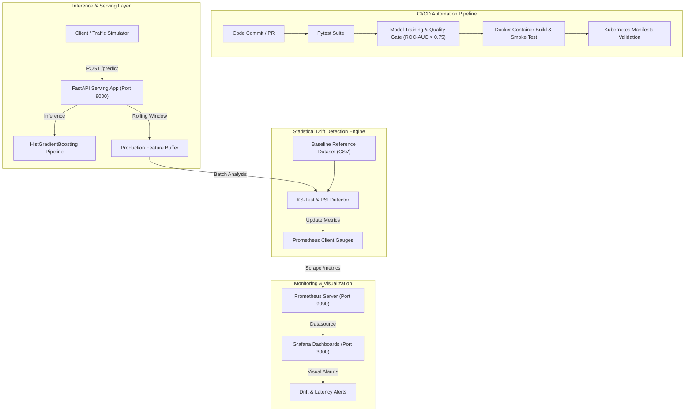

# 🚀 Production MLOps Model Deployment & Monitoring with Real-time Drift Detection

An end-to-end, enterprise-grade MLOps system demonstrating modern CI/CD practices, containerization, Kubernetes orchestration, real-time Prometheus metrics instrumentation, Grafana visualization, and automated statistical data drift detection.

Built from scratch and configured to run seamlessly on a local PC (Windows, macOS, or Linux).

---

## 📑 Architecture Overview



---

## 🌟 Key Features

1. **Production ML Model Pipeline**:
   - High-performance loan default & credit risk classifier using Scikit-Learn's `HistGradientBoostingClassifier`.
   - Feature preprocessing with `StandardScaler` and stratified train/test split.
   - Saves model artifacts (`model.joblib`), evaluation metadata (`model_metadata.json`), and baseline reference dataset (`reference_data.csv`).
2. **Robust Inference Web Service**:
   - Asynchronous FastAPI service with Pydantic V2 request/response schemas.
   - Complete health check endpoints (`/health`, `/live`) for Kubernetes readiness and liveness probes.
   - Non-blocking background drift evaluation tasks.
3. **Statistical Data Drift Detection Engine**:
   - **Kolmogorov-Smirnov (KS) Two-Sample Test**: detects distribution shifts with rigorous $p$-value hypotheses testing ($p < 0.05$).
   - **Population Stability Index (PSI)**: industry-standard financial stability scoring with warning ($0.1 \le \text{PSI} < 0.2$) and alert ($\text{PSI} \ge 0.2$) tiers.
   - **Wasserstein Distance** (Earth Mover's Distance) for standardized distribution divergence.
4. **Real-Time Prometheus & Grafana Monitoring**:
   - Inference latency percentiles ($P_{50}$, $P_{90}$, $P_{99}$).
   - Query throughput ($QPS$) and prediction class distribution.
   - Per-feature drift status gauges, PSI gauges, and dataset drift boolean alert flag.
   - Pre-provisioned Grafana dashboard ready to use upon startup.
5. **Containerization & Kubernetes Orchestration**:
   - Multi-stage, non-root user `Dockerfile` following OCI security best practices.
   - Complete Kubernetes manifests: Namespace, Deployment, NodePort Service, Horizontal Pod Autoscaler (HPA), and ConfigMaps.
6. **Local CI/CD Pipeline Automation**:
   - GitHub Actions workflow (`.github/workflows/ci-cd.yaml`).
   - PowerShell (`scripts/run_pipeline.ps1`) and Bash (`scripts/run_pipeline.sh`) local runner scripts.

---

## 📂 Repository Structure

```
mlops-model-deployment-monitoring/
├── .github/
│   └── workflows/
│       └── ci-cd.yaml                  # GitHub Actions CI/CD pipeline
├── artifacts/                          # Generated model & reference artifacts
│   ├── model.joblib                    # Serialized ML pipeline
│   ├── model_metadata.json             # Metrics & feature specifications
│   └── reference_data.csv              # Baseline training distribution
├── docker/
│   ├── grafana/
│   │   ├── dashboards/
│   │   │   └── mlops_monitoring_dashboard.json  # Pre-built monitoring dashboard
│   │   └── provisioning/
│   │       ├── dashboards/dashboard-provider.yml
│   │       └── datasources/datasource.yml       # Auto-configures Prometheus
│   └── prometheus/
│       └── prometheus.yml              # Prometheus scrape configuration
├── k8s/                                # Kubernetes manifests
│   ├── namespace.yaml                  # 'mlops' dedicated namespace
│   ├── ml-deployment.yaml              # ML service deployment (2 replicas)
│   ├── ml-service.yaml                 # NodePort service (port 30800)
│   ├── ml-hpa.yaml                     # Horizontal Pod Autoscaler
│   ├── prometheus/                     # Prometheus K8s deployment & config
│   └── grafana/                        # Grafana K8s deployment & config
├── scripts/
│   ├── run_pipeline.ps1                # PowerShell Local CI/CD pipeline runner
│   ├── run_pipeline.sh                 # Bash Local CI/CD pipeline runner
│   ├── setup_cluster.ps1               # Automated Kind cluster setup script
│   └── simulate_traffic.py             # Normal & drifted traffic injection tool
├── src/
│   ├── app.py                          # FastAPI serving app with metrics & drift
│   ├── drift_detector.py               # Statistical KS-test & PSI drift algorithms
│   ├── model.py                        # Model pipeline & data generator
│   ├── monitoring.py                   # Prometheus metrics definitions
│   └── train.py                        # Training CLI with quality gate
├── tests/
│   ├── test_api.py                     # API endpoint & metrics tests
│   ├── test_drift.py                   # Drift calculation & PSI unit tests
│   └── test_model.py                   # ML pipeline & dataset unit tests
├── Dockerfile                          # Production container image definition
├── docker-compose.yml                  # 1-Click local PC orchestration
├── requirements.txt                    # Production runtime dependencies
└── requirements-dev.txt                # Development & testing dependencies
```

---

## ⚡ Quickstart Guide (Local PC)

### 🔹 Option 1: 1-Click Launch with Docker Compose (Recommended for PC)

This starts the entire ecosystem (ML Service, Prometheus, and Grafana) locally with pre-wired networking and automatic dashboard provisioning:

```powershell
# 1. Start all services
docker compose up --build -d

# 2. Check service status
docker compose ps
```

Once started, access the services in your browser:
| Service | URL | Purpose | Credentials |
| :--- | :--- | :--- | :--- |
| **Model API (Swagger)** | [http://localhost:8000/docs](http://localhost:8000/docs) | Interactive API documentation | None |
| **Prometheus Server** | [http://localhost:9090](http://localhost:9090) | Target metrics & query explorer | None |
| **Grafana Dashboard** | [http://localhost:3000](http://localhost:3000) | Real-time monitoring & drift dashboards | Anonymous / admin:admin |

---

### 🔹 Option 2: Full Kubernetes Deployment (Kind / Minikube)

Run the automated cluster setup script or execute step-by-step:

```powershell
# Step 1: Create Kind cluster (if not already running)
kind create cluster --name mlops-cluster

# Step 2: Build and load image into Kind
docker build -t ml-credit-service:latest .
kind load docker-image ml-credit-service:latest --name mlops-cluster

# Step 3: Deploy all manifests
kubectl apply -f k8s/namespace.yaml
kubectl apply -f k8s/prometheus/
kubectl apply -f k8s/grafana/
kubectl apply -f k8s/ml-deployment.yaml
kubectl apply -f k8s/ml-service.yaml
kubectl apply -f k8s/ml-hpa.yaml

# Step 4: Verify pods are Running
kubectl get pods -n mlops

# Step 5: Forward ports to access locally
kubectl port-forward svc/ml-service 8000:8000 -n mlops
kubectl port-forward svc/prometheus-service 9090:9090 -n mlops
kubectl port-forward svc/grafana-service 3000:3000 -n mlops
```

---

## 🧪 Simulating Traffic & Watching Real-Time Drift Detection

We provide a dedicated traffic simulation tool (`scripts/simulate_traffic.py`) that demonstrates statistical drift detection live:

### 1. Run Scenario Mode (Baseline Traffic followed by Injected Drift)

```powershell
python scripts/simulate_traffic.py --host http://localhost:8000 --mode scenario
```

**What happens during this run?**
1. **Phase 1 (Baseline Traffic - 40 requests)**:
   - Requests are drawn from the training distribution.
   - Drift detector reports: `Dataset Drift: False`, `Drifted Features: 0`.
   - Grafana dashboard shows **HEALTHY (NO DRIFT)** in green.
2. **Phase 2 (Drift Injection - 45 requests)**:
   - Requests simulate an economic shock: lower credit scores, elevated debt-to-income ratio, income drop.
   - Kolmogorov-Smirnov test $p$-values drop below $0.05$ and PSI rises above $0.20$.
   - Prometheus metrics update instantaneously.
   - Grafana dashboard turns **DRIFT DETECTED** in bright red, highlighting the specific drifted features!

### 2. Continuous Traffic Mode

Keep sending requests while exploring Grafana:

```powershell
python scripts/simulate_traffic.py --host http://localhost:8000 --mode continuous
```

---

## 🛠️ Local CI/CD Pipeline Execution

Run the complete CI/CD verification locally with a single command:

```powershell
# On Windows PC:
powershell -ExecutionPolicy Bypass -File scripts/run_pipeline.ps1

# On Linux / macOS / Git-Bash:
bash scripts/run_pipeline.sh
```

**Pipeline Stages:**
- **Stage 1 (Unit & Integration Tests)**: Executes `pytest` across model, drift, and API test suites.
- **Stage 2 (Model Evaluation Quality Gate)**: Trains pipeline and enforces `ROC-AUC >= 0.75`.
- **Stage 3 (Container Build)**: Builds and verifies Docker container image.
- **Stage 4 (Kubernetes Validation)**: Executes client-side dry-run validation of all K8s manifests.

---

## 📊 Drift Detection Mathematics

### 1. Kolmogorov-Smirnov (KS) Two-Sample Test
The KS test evaluates whether the empirical cumulative distribution function (ECDF) of the current inference buffer $F_{\text{curr}}(x)$ diverges significantly from the baseline reference $F_{\text{ref}}(x)$:
$$D = \sup_x |F_{\text{curr}}(x) - F_{\text{ref}}(x)|$$
If $p\text{-value} < 0.05$, the null hypothesis of equal distributions is rejected, and the feature is flagged as drifted.

### 2. Population Stability Index (PSI)
Used extensively in financial risk scoring to quantify population distribution shifts across quantile bins:
$$\text{PSI} = \sum_{i=1}^{k} \left( \text{Actual}_i\% - \text{Expected}_i\% \right) \times \ln\left( \frac{\text{Actual}_i\%}{\text{Expected}_i\%} \right)$$
- $\text{PSI} < 0.1$: No significant change (Green)
- $0.1 \le \text{PSI} < 0.2$: Moderate shift / warning (Yellow)
- $\text{PSI} \ge 0.2$: Significant shift / alarm (Red)

---

## 🎯 Verification & Testing Summary

To run all unit tests manually:
```powershell
python -m pytest -v
```

Output:
```
tests/test_api.py::test_root_endpoint PASSED
tests/test_api.py::test_health_and_liveness PASSED
tests/test_api.py::test_metrics_endpoint PASSED
tests/test_api.py::test_single_prediction_valid PASSED
tests/test_api.py::test_batch_prediction_and_drift_flow PASSED
tests/test_api.py::test_invalid_prediction_payload PASSED
tests/test_drift.py::test_calculate_psi_no_drift PASSED
tests/test_drift.py::test_calculate_psi_significant_drift PASSED
tests/test_drift.py::test_drift_detector_insufficient_samples PASSED
tests/test_drift.py::test_drift_detector_detection_under_shift PASSED
tests/test_model.py::test_generate_synthetic_data PASSED
tests/test_model.py::test_train_model PASSED
======================== 12 passed in 2.07s ========================
```
